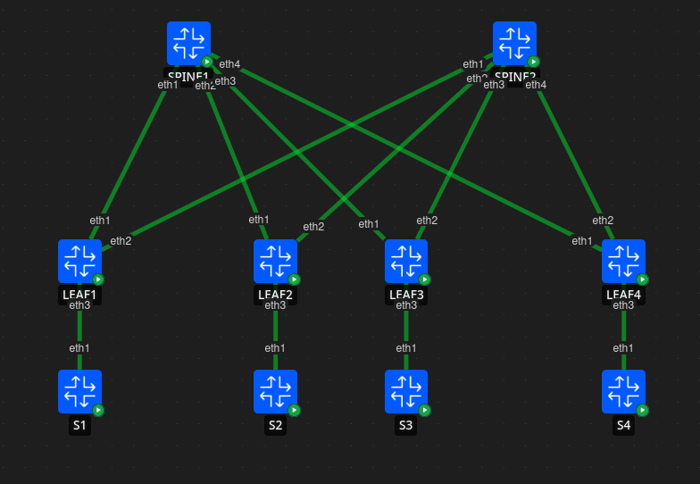

# VXLAN MP-BGP EVPN Layer 2 Data Center Lab

A production-style **VXLAN MP-BGP EVPN Layer 2** data center fabric built with **Arista cEOS** and **Containerlab**.

The project demonstrates how to build a modern Spine-Leaf architecture using an **OSPF underlay**, **MP-BGP EVPN control plane**, and **VXLAN overlay** with multicast-based BUM traffic replication.

---

## Topology

- 2 Spine switches
- 4 Leaf switches
- 4 Linux hosts

### Architecture



---

## Technologies

### Underlay

- OSPF
- IP Multicast
- PIM Sparse Mode
- Anycast RP

### Overlay

- VXLAN
- MP-BGP EVPN
- Layer 2 EVPN
- Dynamic VTEP discovery

---

## Features

- Modern Spine-Leaf architecture
- VXLAN Layer 2 overlay
- MP-BGP EVPN control plane
- Multicast-based BUM traffic replication
- Dynamic MAC learning via EVPN
- End-to-end Layer 2 connectivity
- Production-style Arista EOS configuration
- Hands-on troubleshooting scenarios

---

## Lab Environment

| Component | Technology |
|-----------|------------|
| Network OS | Arista cEOS |
| Lab Platform | Containerlab |
| Hosts | Linux |
| Version Control | Git & GitHub |

---

## Why Arista cEOS + Containerlab?

For EVPN/VXLAN labs, **Arista cEOS** combined with **Containerlab** provides several advantages over traditional virtual lab platforms:

- Lightweight and fast deployment
- Low CPU and memory requirements
- Simple YAML-based topology definitions
- Excellent scalability
- Easy automation
- Git-friendly configuration management
- Ideal for CI/CD and Infrastructure as Code workflows

The entire fabric can be deployed in seconds, making it an excellent environment for learning, testing, and experimentation.

---

## Learning Objectives

This lab demonstrates:

- Spine-Leaf architecture
- OSPF underlay design
- Multicast for VXLAN
- MP-BGP EVPN control plane
- VXLAN encapsulation
- VTEP operation
- EVPN MAC/IP route advertisement
- BUM traffic forwarding
- End-to-end Layer 2 connectivity
- EVPN troubleshooting

---

## Repository Structure

```
.
├── configs/
│   ├── SPINE1.cfg
│   ├── SPINE2.cfg
│   ├── LEAF1.cfg
│   ├── LEAF2.cfg
│   ├── LEAF3.cfg
│   └── LEAF4.cfg
│
├── topology/
│   └── topology.clab.yml
│
├── diagrams/
│
├── images/
│
└── README.md
```

---

## Deployment

Clone the repository:

```bash
git clone https://github.com/<your_username>/<repository>.git
cd <repository>
```

Deploy the lab:

```bash
containerlab deploy -t topology/topology.clab.yml
```

Verify the lab:

```bash
docker ps
```

---

## Validation

Example verification commands:

```bash
show ip ospf neighbor
```

```bash
show bgp evpn summary
```

```bash
show bgp evpn route-type mac-ip
```

```bash
show vxlan vtep
```

```bash
show vxlan address-table
```

```bash
show vxlan flood vtep
```

---

## Future Enhancements

- EVPN Layer 3 (Symmetric IRB)
- Distributed Anycast Gateway
- VRFs and Multi-Tenant Design
- IPv6 EVPN
- BFD
- Ansible automation
- Configuration generation with Jinja2
- CI/CD integration

---

## Resources

- Arista EOS
- Containerlab
- EVPN RFC 7432
- VXLAN RFC 7348

---

## Author

**Vladimir Kovalev**

Network Engineer

GitHub:
https://github.com/<your_username>

LinkedIn:
https://linkedin.com/in/v-kovalev

---

## License

This project is available under the MIT License.
````
